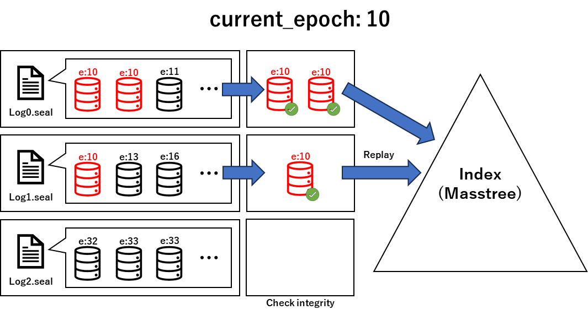

# Silo Recovery Documentation

## Overview

Silo recovery is a critical component of the Silo database system, ensuring data integrity and consistency after system failures. 
This document provides a detailed overview of the recovery process, functions used, and the mechanisms in place to ensure robust data recovery.

**NOTE**: This implementation **is not based** on [SiloR](https://www.usenix.org/system/files/conference/osdi14/osdi14-paper-zheng_wenting.pdf), but rather it focuses on inspecting log data to ensure consistency, followed by log replay for data recovery.

## Log Storage Structure Overview


In this section, we will explain the structure and content of the `pepoch.seal` and `log.seal` files, which are utilized for logging and persisted in storage.

### The pepoch.seal File
This file plays a critical role in the recovery process and includes the following components:

- `Durable Epoch`: An 8-byte (`uint64_t`) representation of the most recent confirmed safe state of the system, indicating up to which point the data is guaranteed to be consistent and durable.
- `Last Hashes of log.seal Files`: These are `SHA256` hashes, each 64 bytes in length, and there is one such hash for every log.seal file. They act as a hash chain, certifying the integrity of the corresponding log file.

Each last hash corresponds to a `log.seal` file, ensuring that any changes or corruption in the logs can be detected.

### The log.seal Files

Each `log.seal` file contains a sequence of records structured as follows:

- `Log Record Size`: The size of an individual log record is specified at the beginning of each record. It is stored as an 8-byte `size_t` value.

- `Log Record`: Following the size, the actual log record data is stored. This data includes the operation type, the keys and values involved, and references to previous records for integrity checks.

The log records are structured in JSON format, for example:

```
{
  "log_header": {
    "log_record_num": 2,
    "prev_epoch_hash": "0520a81431bbb39f67f82f030ebd516d0f3643d63480a9fda94dbae2d5f099c0"
  },
  "log_set": [
    {
      "key": "hoge",
      "op_type": "INSERT",
      "prev_hash": "932396c1e3aadd2752dfd814f294357cd57103b8b54356ebb8f1b077a4282ade",
      "tid": 206158430210,
      "val": "fuga"
    },
    {
      "key": "piyo",
      "op_type": "INSERT",
      "prev_hash": "4328bb1ae28d891b28fec6e2d247670d249ad34a5ea51ac9c93d520c1f509ae4",
      "tid": 206158430210,
      "val": "pao"
    }
  ]
}
```

Under normal operations, these files contain encrypted log records utilizing SGX's sealing capabilities.

#### Components Explained:

- `log_header`: Contains metadata about the log record set, such as the number of records and the hash of the previous epoch for continuity verification.
- `log_set`: An array of individual log entries, each with:
    - `key`: The key involved in the operation.
    - `op_type`: The type of operation performed (e.g., INSERT, UPDATE).
    - `prev_hash`: The hash of the previous log record, creating a chain that verifies the sequence and integrity of operations.
    - `tid`: The transaction identifier.
    - `val`: The value associated with the key for the operation.

CASSA supports concurrent logging, meaning that there is a `log.seal` file for each logger thread responsible for encrypting and writing log data. By default, the files are named sequentially, like `log0.seal`, `log1.seal`, etc.

**Note**: Traditionally, a SHA256 hash is 32 bytes long. However, for enhanced readability and easier debugging, they are stored as 64-byte hexadecimal strings in CASSA. Plans are in place to transition to a binary format for hashes to achieve storage and performance optimization.

## Recovery Process Detailed Explanation



The recovery process entails meticulous steps to restore the database's integrity after an unexpected shutdown or failure. The `RecoveryManager::execute_recovery` function orchestrates this process through the following steps:

### Step 1: Read Durable Epoch from EPOCH_FILE_PATH (pepoch.seal)

Initially, the durable epoch is read from the `EPOCH_FILE_PATH` (`pepoch.seal`). This epoch, indicating the last consistent state, is stored in the first 8 bytes of the file.

### Step 2: Read Last Log Record Hashes

The hashes of the last log records are read next. The number of these hashes is calculated by subtracting 8 from the file size and then dividing by 64, as each hash (in SHA256 format) is stored as a 64-byte hexadecimal string.

### Step 3: Load Log File Sizes and Read Current Epoch Data

The size of each log file is determined, after which log records for the current epoch are read. The size of each log record, occupying the first 8 bytes, precedes the log record itself. Subsequently, the log record, stored in encrypted JSON format, is decrypted using SGX's unsealing capabilities and deserialized into a `RecoveryLogSet` structure.

### Step 4: Log Level Integrity Verification

Each log set undergoes a log-level integrity check. Log sets contain a `prev_hash` field linking them to the hash of the previous log record, forming a circular hash chain with the head of the chain holding the hash of the last record.

### Step 5: Epoch Level Integrity Verification

After log-level validation, epoch-level integrity checks ensure each log record is part of a unidirectional hash chain. This chain is cyclically linked to credential data at the beginning and the last hash value in `pepoch.seal`, ensuring the overall integrity of the logs.

### Step 6: Sort Logs by TID and Replay Content

Once integrity is assured, logs are sorted by their transaction ID (`tid`) and replayed to reconstruct the database state.

### Step 7: Repeat for Each Epoch

The process repeats, incrementing the current epoch and replaying its logs until the durable epoch is reached, signifying the completion of recovery.

## Future work

While the current implementation of the recovery process in CASSA is robust and efficient, there are areas that require further development to ensure even greater reliability and fault tolerance, especially in operational environments:

### Enhancing Redundancy in Log Data

The current design does not inherently incorporate redundancy in the log data. This means that while the logs are carefully managed and validated, they are singular in their existence. In a scenario where the storage medium becomes unreliable or corrupted, this could pose a significant risk to data integrity.

To mitigate such risks, introducing redundancy in the log storage mechanism is crucial. This can be achieved in several ways:

- `Distributed Agreement Algorithms`: Implementing distributed consensus algorithms such as Raft can enhance data redundancy and consistency. By replicating log data across multiple nodes, the system becomes resilient to both failures and tampering of individual nodes, thereby preventing data loss and maintaining data integrity.
- `Multi-Vendor Storage Solutions`: Employing multiple storage vendors or solutions can provide another layer of redundancy. This approach diversifies the risk associated with relying on a single storage provider, ensuring that if one system fails, others can compensate for the loss.